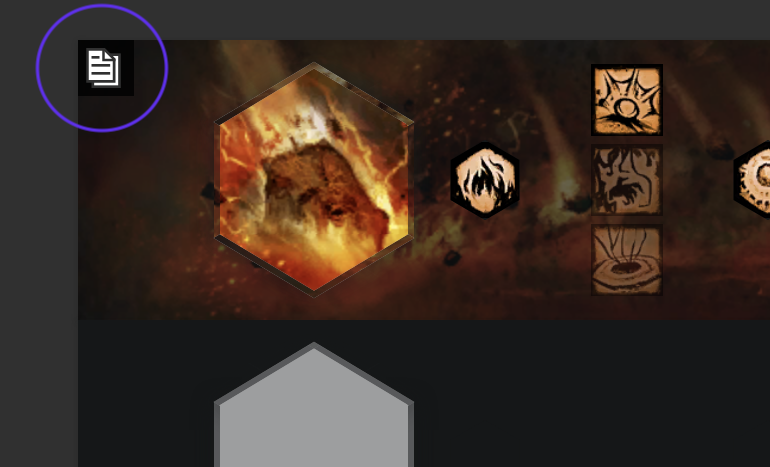
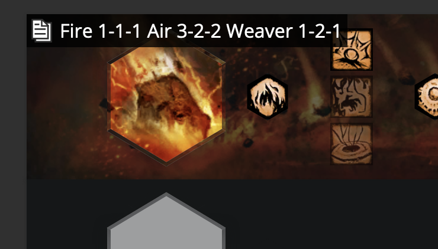
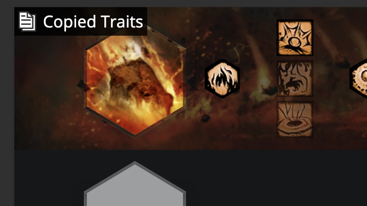

# copy traits

Adds a button to GW2 Armory spec embeds to view and copy the trait selections.
Currently lacks l10n support, file an issue if you want this to change.

Either copy the script locally or link to this repo:
```
<script src="https://hobinjk.github.io/copy-traits/build/copy-traits.js"></script>
```



